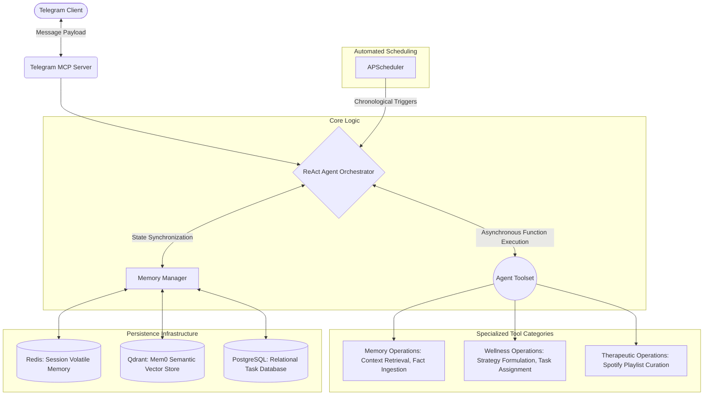
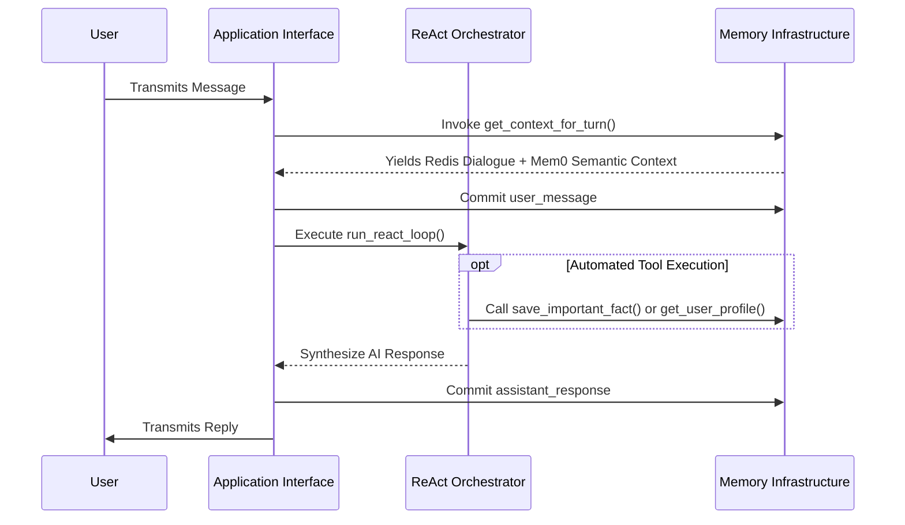

# Psych Buddy: Autonomous Psychological Support Agent

Psych Buddy operates as an autonomous, evidence-based psychological support system built upon a ReAct (Reasoning and Acting) cognitive architecture. Engineered to deliver continuous mental wellness interventions through the Telegram messaging protocol, the application functions as a proactive companion. It actively monitors user psychological states, formulates tailored coping mechanisms, and oversees the completion of therapeutic exercises.

The core reasoning engine leverages Google Gemini 3.6 Flash. To ensure interaction continuity and contextual awareness, the system implements a sophisticated tripartite memory architecture. This infrastructure allows the agent to synthesize long-term historical context, recognize behavioral patterns, and prevent repetitive information gathering.

## System Architecture and Control Flow

A centralized ReAct Orchestrator manages the entirety of the application logic. This component evaluates incoming user data, queries the memory subsystems for contextual grounding, executes specialized Python functions (tools), and synthesizes a therapeutic response.

## Persistence and Memory Subsystems

To simulate human cognitive continuity, Psych Buddy utilizes a three-tiered data persistence model coordinated by the `MemoryManager` class.

1. Short-Term Volatile Memory (Redis)
   This layer functions as the immediate working memory. It stores recent conversational turns and transient session states. The implementation guarantees ultra-low latency recall for active, ongoing dialogues.

2. Semantic and Episodic Memory (Mem0 and Qdrant)
   Powered by the Mem0 framework, this layer utilizes Qdrant as the backend vector database alongside local sentence-transformer models for generating localized embeddings. The agent autonomously extracts and archives critical user facts (for example, significant life events or specific stressors). During the initialization of a ReAct loop, the system queries this semantic store to inject historical context directly into the prompt payload.

3. Relational Persistence (PostgreSQL)
   Managed via SQLAlchemy and the asyncpg driver, this database handles structured, durable records. It tracks discrete user sessions, longitudinal mental state assessments, scheduled wellness routines, and administrative metadata. This ensures user progression remains intact across deployment restarts.

### Contextual Retrieval Sequence

## Technology Stack and Core Implementation

Primary Frameworks:
* Reasoning Engine: google-generativeai (Gemini 3.6 Flash)
* Agent Coordination: Custom asynchronous ReAct loop
* Client Integration: python-telegram-bot utilizing a Model Context Protocol paradigm
* Chronological Automation: apscheduler for timezone-aware task triggers
* Vector Infrastructure: mem0ai, qdrant-client, sentence-transformers
* Relational Infrastructure: asyncpg, sqlalchemy, redis

Crucial Functions:
* AgentOrchestrator.run_react_loop(): The nucleus of the reasoning system. This method injects historical context, manages the Gemini API interaction, parses function call requests, executes the corresponding Python routines asynchronously, and integrates the results to formulate the final clinical response.
* MemoryManager.get_context_for_turn(): Aggregates immediate conversational history from Redis and relevant episodic vectors from Mem0 for comprehensive prompt formulation.
* Factory Methods: get_wellness_tools() and get_memory_tools() expose asynchronous JSON schemas to the language model, facilitating operations such as schedule_program or save_important_fact.

## Risk Mitigation and Safety Protocols

Deploying automated psychological support necessitates rigorous safety boundaries. The architecture includes multiple safeguards to ensure user protection and triage critical incidents.

1. Crisis Identification Protocol
   The configuration defines a strict set of crisis keywords (including terms related to self-harm). The foundational system instructions explicitly mandate the language model to prioritize these signals and instantly activate the crisis intervention pathway.
   
2. Clinical Threshold Monitoring
   The mental state configuration module establishes quantifiable intensity limits. If the agent classifies a user's emotional state as severe, the internal logic flags the session. This action immediately overrides standard conversational flows to present professional emergency resources.

3. Emergency Resource Deployment
   A statically mapped dictionary of emergency contacts (for example, the 988 Suicide and Crisis Lifeline) is injected directly into the conversational output whenever the risk assessment algorithm detects a boundary violation.

Disclaimer: Psych Buddy represents an experimental artificial intelligence application. It does not replace professional clinical evaluation, diagnosis, or psychiatric intervention.